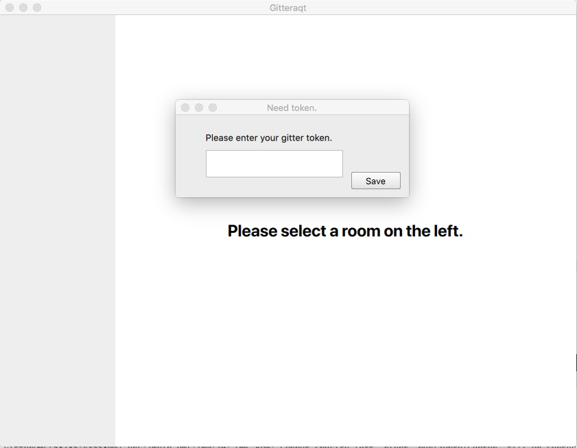
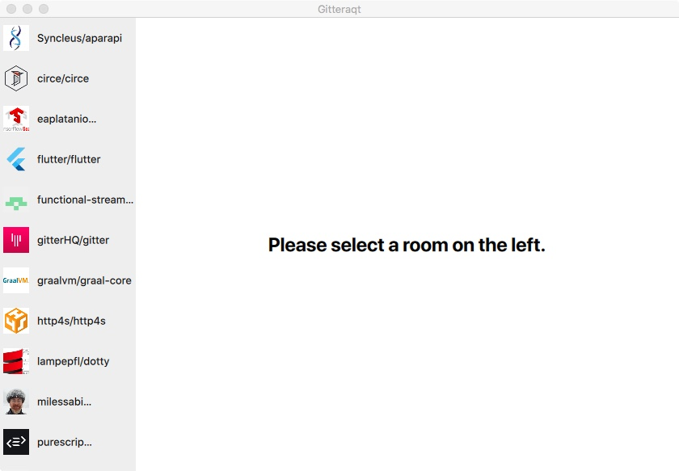
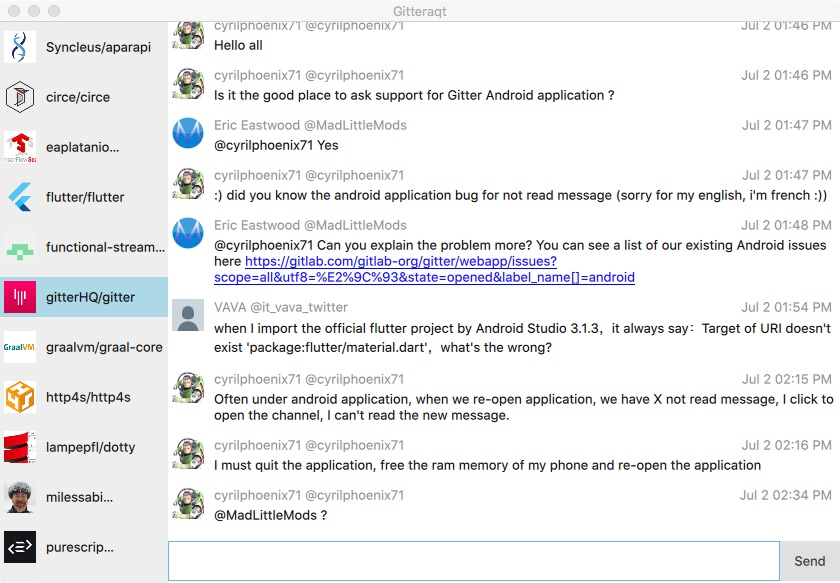

# Gitteraqt

A native gui app for Gitter written in QML/Qt. Let's make a truly beautiful and feature rich app, please contribute.

## Credits
- [Phrogz](https://github.com/Phrogz) for https://github.com/Phrogz/rb3jay/blob/master/qt-client/BayeuxClient.qml
- [paulovap](https://github.com/paulovap) for https://github.com/paulovap/qtleveldb
- [OlehKulykov](https://github.com/OlehKulykov) for https://github.com/OlehKulykov/FayeCpp

## How to get

Checkout [releases](https://github.com/eklavya/Gitteraqt/releases).

## How to use

Get a token from [Gitter](https://developer.gitter.im).

Paste it in the app.

Once done, wait for some time. Sorry for the jankiness at start, everything is on UI thread right now.

Select a room on the left.

Cmd/Ctrl + enter will send the message or hit the send button.
